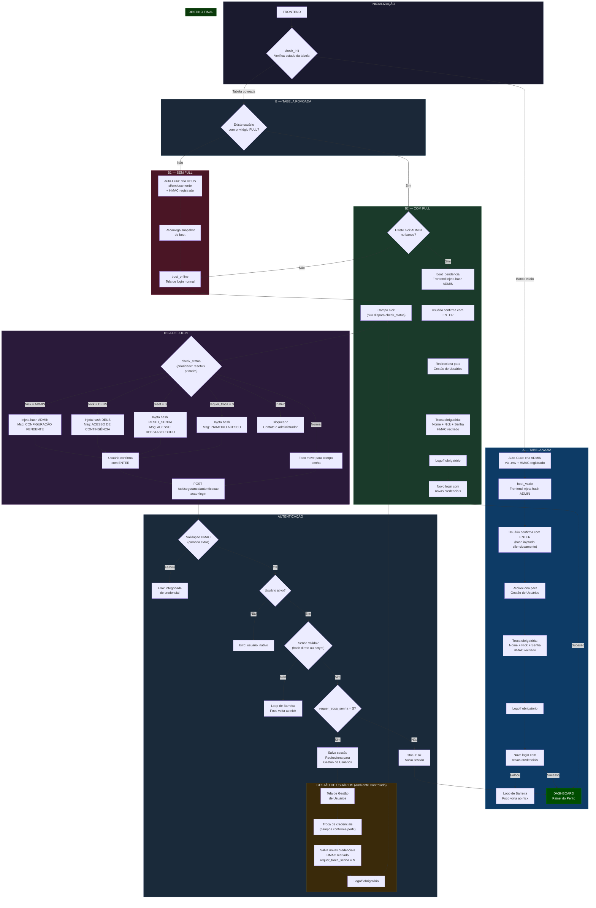
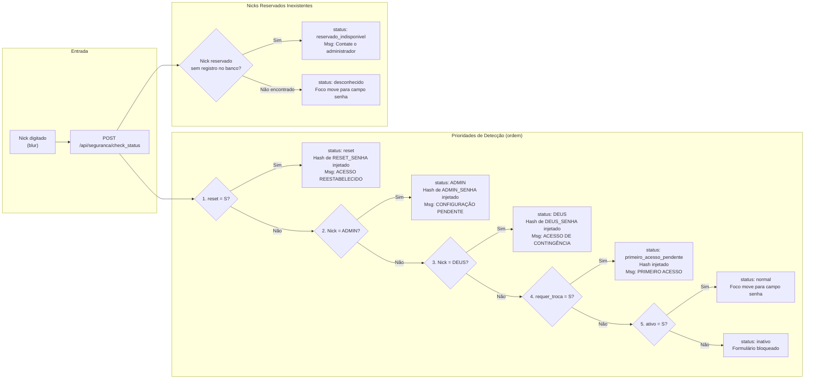
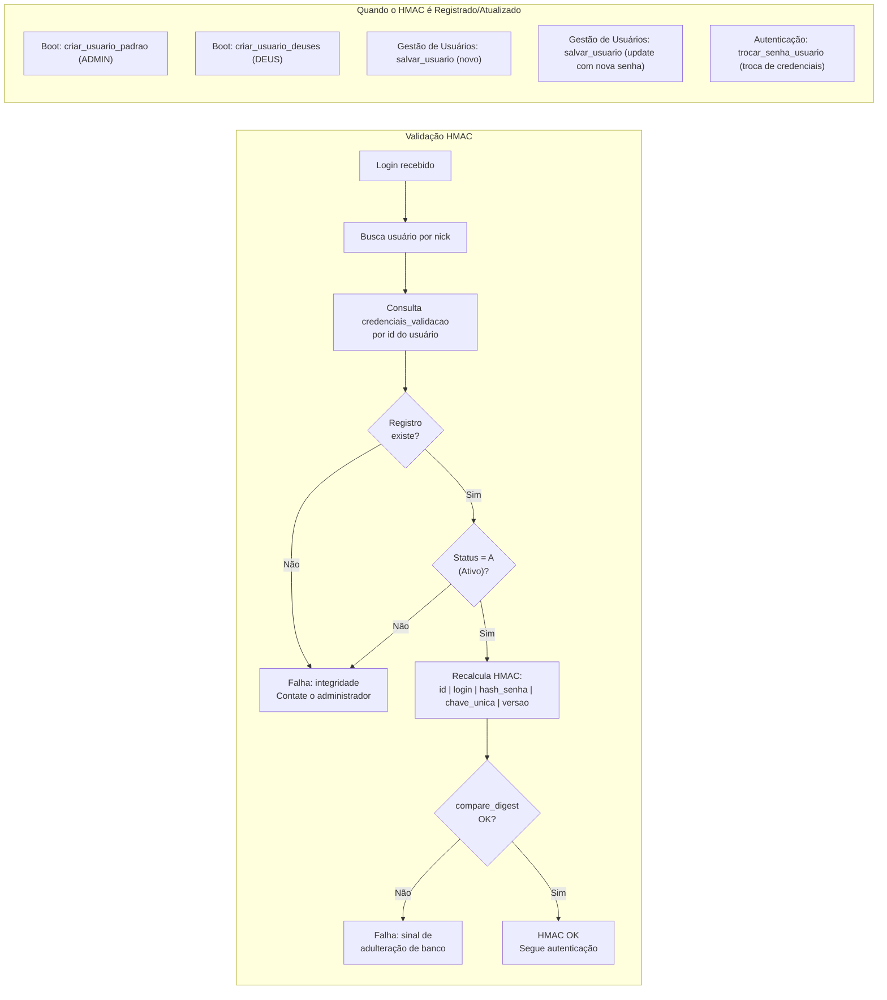
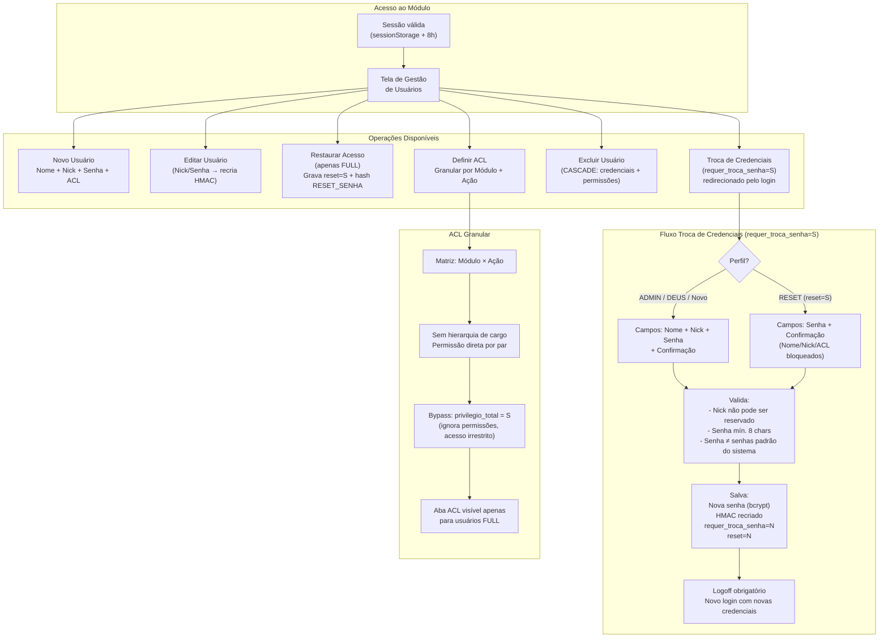
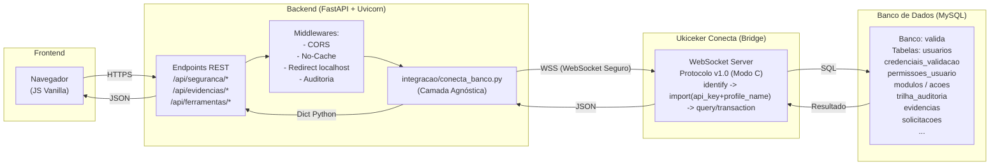

# FLUXOGRAMA VISUAL — Valida Provas PRO (v1.0)

> Documento Normativo Oficial — gerado em 04/04/2026.
> Reflete a arquitetura implementada e homologada pelo Arquiteto do Sistema.
> Qualquer alteração deve ser registrada no `diario_de_bordo.md`.

## Status Atual (2026-04-19)

- Integração em migração aplicada para protocolo Ukiceker v1.0 com autenticação Modo C (API Key + Profile Name).
- Operação do Valida consolidada em runtime WebSocket-only, sem provisão HTTP automática no cliente.
- Validação técnica real concluída com Ukiceker ativo: health, api-key, profile, import e query.
- Contrato HTTP consolidado: `api-key` exige `backend_id`; `profile` exige objeto `conexao` completo.
- Discrepâncias de legado documental saneadas e marcadas com contexto histórico onde aplicável.
- Saneamento complementar concluído em instruções de fase, arquitetura atual e guia de consultas da integração.
- Próxima etapa obrigatória: validação funcional de negócio com transações DML em ambiente controlado.

---

## Definições Oficiais

| Conceito | Quem é | Quem dispara | Campos na troca | ACL |
|----------|--------|--------------|-----------------|-----|
| **ADMIN** | Primeiro usuário do sistema, criado automaticamente | Boot com tabela vazia | Nome + Nick + Senha | Privilégio FULL gerado automaticamente |
| **DEUS** | Super-usuário de contingência, criado silenciosamente | Auto-cura (sem FULL na base) | Nome + Nick + Senha | Privilégio FULL gerado automaticamente |
| **RESET** | Usuário existente que perdeu o acesso | Admin clica "Restaurar Acesso" (botão exclusivo para FULL) | **Só Senha + Confirmação** (Nome/Nick/ACL bloqueados) | Mantém ACL existente intocada |

> **Lógica de Senhas Universal:** O backend envia o **hash bcrypt** para o frontend injetar silenciosamente.
> O backend detecta se recebeu hash (comparação direta) ou texto plano (`bcrypt.checkpw`).
> Hash direto só é aceito se `requer_troca_senha='S'`.

> **Silêncio Absoluto:** A senha nunca é exibida ou enviada em mensagem ao usuário.
> O hash bcrypt é injetado pelo frontend de forma transparente.

---

## Fluxo Mestre

---

## Detalhamento: check_status (Blur no Campo Nick)

> Executado automaticamente ao sair do campo nick (evento `blur`).
> Determina o tipo de credencial e injeta o hash no campo senha silenciosamente.

---

## Detalhamento: Camada HMAC (Validação Extra)

> Camada de segurança adicional executada em **todo login**, antes de qualquer outra verificação de negócio.
> Garante integridade da credencial mesmo em caso de dump parcial do banco.

---

## Detalhamento: Gestão de Usuários (Ambiente Controlado)

> Acesso restrito a usuários autenticados.
> Toda operação de credencial é registrada na trilha de auditoria imutável.

---

## Arquitetura de Integração

> O sistema opera em arquitetura **agnóstica**: o backend nunca acessa o banco diretamente.
> Toda comunicação de dados passa pela camada WebSocket (Ukiceker Conecta).

---

## Tabela Comparativa de Perfis

| Aspecto | ADMIN | DEUS | RESET |
|---------|-------|------|-------|
| **Quem é** | 1º usuário do sistema | Contingência silenciosa | Existente, perdeu acesso |
| **Nick na tela** | ADMIN | DEUS | Nick real do usuário |
| **Detecção** | `check_status` (nick=ADMIN) | `check_status` (nick=DEUS) | `check_status` (reset=S) **PRIORIDADE** |
| **Hash injetado** | Hash bcrypt de ADMIN_SENHA (.env) | Hash bcrypt de ADMIN_SENHA (.env) | Hash bcrypt de RESET_SENHA (.env) |
| **Campos na troca** | Nome + Nick + Senha | Nome + Nick + Senha | **Só Senha + Confirmação** |
| **ACL** | FULL gerada automaticamente | FULL gerada automaticamente | Mantida intacta |
| **Após salvar** | Nick ADMIN desaparece do banco | Nick DEUS desaparece do banco | `reset=N` |

---

## Regras de Ouro

> **Silêncio Absoluto:** O hash bcrypt é injetado silenciosamente pelo frontend. A senha nunca aparece em mensagem, log visível ao usuário ou campo de texto legível.

> **Hash só com Pendência:** O backend aceita comparação direta de hash (`senha_input == hash_armazenado`) **somente** se `requer_troca_senha='S'`. Login normal usa sempre `bcrypt.checkpw`.

> **Prioridade do RESET:** No `check_status`, `reset=S` é verificado **antes** de qualquer outro perfil (ADMIN, DEUS, normal). Se `reset=N`, segue com as demais verificações.

> **Loop de Barreira:** Credencial inválida → campo nick limpo → foco retorna ao nick → sem limite de tentativas programático → acesso barrado até acertar.

> **Auto-Cura Soberana:** No boot, o sistema verifica e corrige seu próprio estado: banco vazio → cria ADMIN. Sem super usuário → cria DEUS silenciosamente. Ambos incluem registro HMAC obrigatório.

> **ACL Intocável:** A troca de credenciais **nunca** altera permissões. ACL é gerenciada exclusivamente pelo módulo de gestão de usuários, por usuário FULL.

> **HMAC Obrigatório:** Todo login passa pela validação HMAC antes de qualquer verificação de negócio. Registro ausente ou divergente = falha de integridade = acesso negado.

> **Ambiente Controlado:** Troca de credenciais ocorre exclusivamente na tela de Gestão de Usuários, com sessão autenticada ativa. Logoff e novo login são obrigatórios após a troca, para registro em auditoria.

---

## Mapa de Endpoints de Autenticação

| Endpoint | Método | Ação | Descrição |
|----------|--------|------|-----------|
| `/api/seguranca/autenticacao` | POST | `check_init` | Diagnóstico de boot |
| `/api/seguranca/autenticacao` | POST | `login` | Autenticação completa |
| `/api/seguranca/check_status` | POST | — | Estado do nick (blur) |
| `/api/seguranca/trocar_senha` | POST | — | Troca de credenciais (gestão de usuários) |
| `/api/seguranca/usuarios` | GET | — | Listar usuários |
| `/api/seguranca/usuarios/salvar` | POST | — | Criar/editar usuário |
| `/api/seguranca/usuarios/excluir/{id}` | DELETE | — | Remover usuário |
| `/api/seguranca/acl/modulos_acoes` | GET | — | Estrutura de ACL |
| `/api/seguranca/acl/usuario/{id}/salvar` | POST | — | Salvar permissões |
